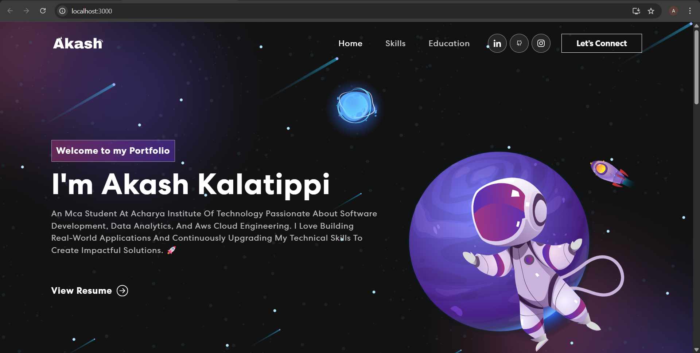

<h1 align="center">Hi 👋, I'm Akash Kalatippi</h1>
<h3 align="center">🚀 MCA Student | Software Developer | Data Analytics Enthusiast | AWS Cloud Learner</h3>

  

---

## 🌌 About Me

🎓 MCA Student at Acharya Institute of Technology  
💡 Passionate about building real-world applications  
📊 Interested in Data Analytics & Cloud Engineering  
☁️ Learning AWS & Modern Web Technologies  
🚀 Always upgrading my technical skills  

---

## 🖥️ Portfolio Preview

(Add your portfolio screenshot below)

🌐 **Live Website:** (Add deployed link here)

---

## 🛠️ Tech Stack

### 🚀 Frontend
- React.js
- JavaScript (ES6+)
- HTML5
- CSS3
- Bootstrap / React-Bootstrap

### ⚙️ Tools & Technologies
- Git & GitHub
- VS Code
- Node.js
- npm

---

## ✨ Features

✔️ Modern Space-Themed UI 🌌  
✔️ Fully Responsive Design 📱💻  
✔️ Smooth Navigation  
✔️ Resume Download Option  
✔️ Social Media Integration  
✔️ Skills & Education Section  

---

## 📂 Project Structure

